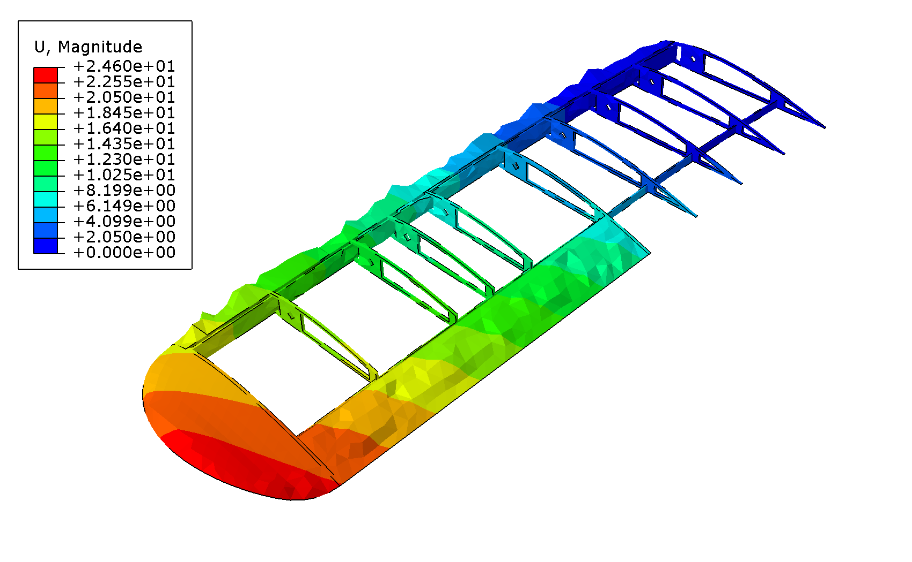
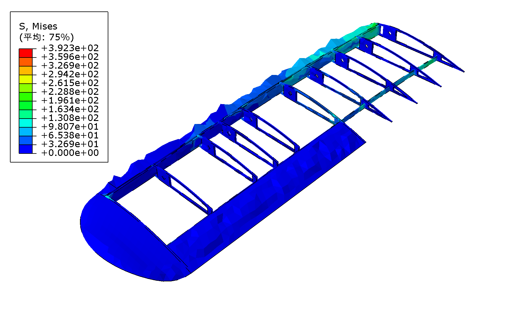

# 机翼内部骨架 静力分析流水线

从 CATIA STEP 几何到 Abaqus 静力结果的完整脚本化流程：
**几何清理 → HyperMesh / gmsh 网格 → 件间 TIE 绑定 → Abaqus 静力求解 → 云图**。

针对一个机翼模型：去掉蒙皮/碳棒/舵机，只保留**内部骨架 4 个件**（翼肋+梁、副翼、前缘、翼梢小翼），做铝合金线性静力分析。

## 结果

| 位移云图 | von Mises 应力云图 |
|---|---|
|  |  |

- 最大位移 `|U| ≈ 24.6 mm`（翼梢，自由端）
- 最大 von Mises `≈ 392 MPa`（翼根固定端，含约束应力集中）
- 求解 1 增量收敛，无奇异（靠 TIE 真连接，不依赖人工稳定化）

> ⚠️ 载荷为**占位值**（压力 0.01 MPa + 重力），换真实工况数值后结果按比例变。

## 流水线

| 阶段 | 脚本 | 说明 |
|---|---|---|
| 1. 几何清理 | `python/clean_airfoil.py` | gmsh 读 STEP，删 vol 5/6/7（碳棒/舵机/蒙皮），导出 `airfoil_frame.stp` |
| 2a. 面网格(gmsh) | `python/mesh_airfoil_gmsh.py` | 全机翼表面三角网格 + 出图（演示用） |
| 2b. 面网格(HM) | `hypermesh/mesh_airfoil_hm.tcl` | HyperMesh 面网格 + 导出 .inp |
| 3. 实体四面体 | `hypermesh/tet_separate.tcl` | HyperMesh 结构 tetra，**4 件界面不合并**（保持独立，给 TIE） |
| 4. 装配 deck | `python/build_tie_deck.py` | 连通块分件 → 件间界面 → `*TIE` 绑定 + 材料/约束/载荷 → `airfoil_tie.inp` |
| 5. 求解 | `abaqus job=airfoil_tie` | Abaqus/Standard 静力 |
| 6. 后处理 | `python/plot_results.py`, `get_results.py` | Abaqus Viewer 出云图 / 提最大值 |
| 可视化辅助 | `python/render_*.py` | matplotlib 渲染网格/分件/体网格 |

`python/gen_sen_mesh.py` 是另一个独立小工具：相场断裂 SEN 拉伸基准的结构网格生成器。

## 连接方式（关键经验）

零件装配体**不能靠合并重合节点来绑定**——件间只在点/边接触时会合并出"点焊/局部机构"，导致刚度奇异。
正确做法是 **`*TIE` 面-面绑定**（带位置容差，跨非共形网格按面积绑），以中枢件为主面、其余件为从面，避免从节点重复（过约束）。

## HyperMesh 2021 踩坑记录

- STEP 翻译器 `*geomimport "STEP"` 报 `AFC_Translator_Main` → 改用 **`"AutoDetect"`**
- 纯三角面网格类型码 = **0**（`*interactiveremeshsurf ... 0 0 ...`）
- 实体四面体别用 CFD 的 `*tetmesh ... 3 ...`（segfault），用结构 tetra **mode 9** + `*createstringarray` 参数
- 用 **`hmbatch.exe -tcl`** 跑脚本，输出可直接捕获，便于调试

## 用法

```bash
# Python 侧 (gmsh + matplotlib + scipy)
python clean_airfoil.py            # -> airfoil_frame.stp
python build_tie_deck.py           # -> airfoil_tie.inp  (需先有 airfoil_parts_tet.inp)

# HyperMesh 侧 (批处理)
hmbatch.exe -tcl tet_separate.tcl  # -> airfoil_parts_tet.inp

# Abaqus
abaqus job=airfoil_tie interactive
abaqus viewer noGUI=plot_results.py
```

> 脚本里的路径是本地绝对路径（`C:/Users/Liu/...`），按需修改。输入 CAD `airfoil.stp` 未包含在仓库中。

## 自研 C++ 有限元求解器（`cpp/`）

一个**自包含、零依赖**的线弹性有限元求解器，4 节点四面体（C3D4）：
组装 → Dirichlet 约束 → 预处理共轭梯度求解 → 输出 **VTK**（位移 + von Mises）给 ParaView。

- `cpp/fem3d.cpp` — 求解器（单文件）。编译：`g++ -O2 -std=c++17 fem3d.cpp -o fem3d`
- `cpp/make_cantilever.py` — 悬臂梁验证算例生成器
- 输入为简单文本格式（NODES / ELEMENTS / MATERIAL / GRAVITY / FIX / NFORCE）

**验证**（悬臂梁，对比理论解）：

| 算例 | C++ FE | 理论 | 误差 |
|---|---|---|---|
| 轴向拉伸 `PL/(AE)` | 0.01433 mm | 0.01429 mm | **0.32%** ✓ |
| 弯曲挠度 `PL³/(3EI)` | 2.90 mm | 5.71 mm | 偏刚 ~2×（线性四面体剪切自锁，加密/二阶可收敛） |

轴向精确说明组装/求解/边界正确；弯曲偏刚是线性四面体的固有特性（与 Abaqus C3D4 一致）。

```bash
g++ -O2 -std=c++17 cpp/fem3d.cpp -o fem3d
python cpp/make_cantilever.py axial cantilever.txt
./fem3d cantilever.txt out.vtk        # -> ParaView 打开 out.vtk
```
